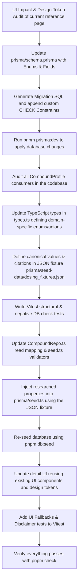

# Refined Dosing Schedule & Cycle Protocol Redesign Plan

This document details the final, production-ready architecture for storing and displaying high-level dosing schedule and cycle protocol metadata. It addresses all findings from the Multi-Model Review (MMR) rounds, ensuring clinical accuracy, correct research-use provenance, strict type safety, database-level integrity, and defensive UI state modeling.

---

## Prerequisites & Package Scripts
This plan references project-specific `pnpm` scripts defined in `package.json`. If run on clean environments, they map to the following canonical commands:
* `pnpm prisma:dev` -> `npx prisma migrate dev`
* `pnpm db:seed` -> `npx tsx prisma/seed.ts`
* `pnpm check` -> `pnpm lint && pnpm typecheck && pnpm test && pnpm prisma:validate` (which maps to canonical linters, typecheckers, tests, and schema verification)

---

## 1. Refined Database Schema Properties

To avoid simplicity issues (like modeling weekly GLP-1s with daily schedules) and ensure database-level data integrity, we separate the **dosing cadence** from the **cycle structure** and enforce invariants using strict Prisma enums and custom migration-level SQL `CHECK` constraints. We also support compounds that require multiple administrations per day (e.g. GHRPs) and track FDA approval status to drive safety disclaimers.

### Database Provider & Connection Warning Guard
* **Target Provider**: PostgreSQL. PostgreSQL is a strict, hard project-wide requirement for development, CI, and production. All database-level SQL check constraints and test suites are explicitly designed for PostgreSQL.
* **Connection Warning Guard**: In `lib/shared/prisma.ts`, we implement a connection check during initialization. If `DATABASE_URL` does not start with `postgres://` or `postgresql://`, a fatal error is thrown immediately to ensure developers fail fast on misconfigured environments (except when overridden by `BYPASS_PG_GUARD=true` for specific offline troubleshooting).

### Prisma Schema Enums
*(Note: Prisma comments must be on their own separate line above the enum value. Inline comments are prohibited by the parser).*
```prisma
enum DosingFrequency {
  DAILY
  EOD
  // Thrice Weekly (e.g., TB-500)
  THRICE_WEEKLY
  WEEKLY
  TWICE_WEEKLY
  // Replaces ambiguous 'BIWEEKLY'
  EVERY_TWO_WEEKS
  // Replaces 'Monthly'
  EVERY_FOUR_WEEKS
  AS_NEEDED
  CUSTOM
}

enum PreferredTime {
  MORNING
  // Standalone afternoon option
  AFTERNOON
  NIGHT
  PRE_WORKOUT
  POST_WORKOUT
  // Composite for twice-daily administration
  MORNING_AND_NIGHT
  // Composite for thrice-daily administration (e.g. GHRP-2)
  MORNING_AFTERNOON_NIGHT
  // Composite for pre/post workout secretagogues
  PRE_AND_POST_WORKOUT
  ANYTIME
  AS_NEEDED
}
```

*(Note: For non-standard multi-dose timing pairings not covered by the composite enums, ANYTIME or AS_NEEDED must be used).*

### `CompoundProfile` Model Additions
We add the scheduling fields and `isFdaApproved` to the `CompoundProfile` model.
*(Note: The backslash before the `@` symbol in `\@default` is used to prevent markdown-parser link rewriting. Do NOT copy the backslash when implementing in `schema.prisma`).*
```prisma
model CompoundProfile {
  // ... existing fields ...
  // Duration of cycle (e.g., 8, or null for continuous)
  cycleLengthWeeks           Int?
  // Rest period between cycles (e.g., 4, or null if none)
  restPeriodWeeks            Int?
  // Cadence category (e.g., WEEKLY, DAILY)
  dosingFrequency            DosingFrequency?
  // Doses per administration day (e.g. 2 or 3 for GHRPs)
  dosesPerDay                Int?
  // Descriptive text if frequency is CUSTOM
  customFrequencyDescription String?
  // Days on per weekly cycle (Optional for DAILY frequency)
  daysOn                     Int?
  // Days off per weekly cycle (Optional for DAILY frequency)
  daysOff                    Int?
  // Dosing time enum
  preferredTime              PreferredTime?
  // Dietary/admin instructions
  timingNotes                String?
  // Controls whether 'Research Use Only' disclaimer is shown
  isFdaApproved              Boolean           \@default(false)
}
```

### Database-Level CHECK Constraints (PostgreSQL Migration SQL)
We will customize the generated SQL migration to add database-level `CHECK` constraints. To avoid SQL `NULL` propagation leaks (where `NULL OR FALSE` evaluates to `NULL` and incorrectly bypasses `CHECK` constraints), we use PostgreSQL `COALESCE` statements to normalize nullable fields:

*(Note: These constraints correspond directly to the validation rules in `lib/reference/domain/validation.ts`. Any changes to these constraints must be synchronized with validation rules).*

```sql
-- Numeric bounds validation:
-- dosesPerDay is capped at 8 to allow advanced pulse-mimicry protocols (e.g. GHRP pulses) while maintaining safety.
-- cycleLengthWeeks and restPeriodWeeks are capped at 104 (2 years) to prevent absurd inputs.
ALTER TABLE "CompoundProfile" ADD CONSTRAINT "chk_cycle_length" CHECK ("cycleLengthWeeks" IS NULL OR ("cycleLengthWeeks" >= 1 AND "cycleLengthWeeks" <= 104));
ALTER TABLE "CompoundProfile" ADD CONSTRAINT "chk_rest_period" CHECK ("restPeriodWeeks" IS NULL OR ("restPeriodWeeks" >= 1 AND "restPeriodWeeks" <= 104));
ALTER TABLE "CompoundProfile" ADD CONSTRAINT "chk_doses_per_day" CHECK ("dosesPerDay" IS NULL OR ("dosesPerDay" >= 1 AND "dosesPerDay" <= 8));

-- Co-occurrence rules for weekly schedule:
-- 1. Continuous daily dosing is canonically represented by NULL daysOn and NULL daysOff.
-- 2. Weekly cycles with off days are only valid for DAILY frequency, requiring daysOn/daysOff to be between 1 and 6, and sum to exactly 7 (prohibiting redundant 7/0 or 0/7).
-- 3. Bounds >=1 and <=6 are enforced here, eliminating the need for redundant standalone day bounds constraints.
ALTER TABLE "CompoundProfile" ADD CONSTRAINT "chk_daily_weekly_schedule" CHECK (
  ("daysOn" IS NULL AND "daysOff" IS NULL) OR
  (coalesce("dosingFrequency"::text, '') = 'DAILY' AND "daysOn" IS NOT NULL AND "daysOff" IS NOT NULL AND "daysOn" >= 1 AND "daysOn" <= 6 AND "daysOff" >= 1 AND "daysOff" <= 6 AND "daysOn" + "daysOff" = 7)
);

-- Custom frequency description co-occurrence rules (enforces non-empty trimmed text)
ALTER TABLE "CompoundProfile" ADD CONSTRAINT "chk_custom_frequency_desc" CHECK (
  (coalesce("dosingFrequency"::text, '') = 'CUSTOM' AND "customFrequencyDescription" IS NOT NULL AND length(trim("customFrequencyDescription")) > 0) OR
  (coalesce("dosingFrequency"::text, '') != 'CUSTOM' AND "customFrequencyDescription" IS NULL)
);

-- Doses per day and preferredTime cross-field compatibility check:
-- Clause 1: If dosesPerDay is >= 2, preferredTime must be non-null.
-- Clause 2: If dosesPerDay is 2, preferredTime must be a twice-daily composite or flexible value.
-- Clause 3: If dosesPerDay is 3, preferredTime must be a thrice-daily composite or flexible value.
-- Clause 4: If dosesPerDay is 4 to 8, preferredTime must be ANYTIME or AS_NEEDED.
-- Clause 5: Bans twice-daily composite times when dosesPerDay is not 2.
-- Clause 6: Bans thrice-daily composite times when dosesPerDay is not 3.
-- (coalesce("dosesPerDay", 0) is used to avoid SQL NULL evaluation leaks).
ALTER TABLE "CompoundProfile" ADD CONSTRAINT "chk_doses_per_day_time_alignment" CHECK (
  (coalesce("dosesPerDay", 0) <= 1 OR "preferredTime" IS NOT NULL) AND
  (coalesce("dosesPerDay", 0) != 2 OR coalesce("preferredTime"::text, '') IN ('MORNING_AND_NIGHT', 'PRE_AND_POST_WORKOUT', 'ANYTIME', 'AS_NEEDED')) AND
  (coalesce("dosesPerDay", 0) != 3 OR coalesce("preferredTime"::text, '') IN ('MORNING_AFTERNOON_NIGHT', 'ANYTIME', 'AS_NEEDED')) AND
  (coalesce("dosesPerDay", 0) < 4 OR coalesce("preferredTime"::text, '') IN ('ANYTIME', 'AS_NEEDED')) AND
  (coalesce("preferredTime"::text, '') NOT IN ('MORNING_AND_NIGHT', 'PRE_AND_POST_WORKOUT') OR coalesce("dosesPerDay", 0) = 2) AND
  (coalesce("preferredTime"::text, '') != 'MORNING_AFTERNOON_NIGHT' OR coalesce("dosesPerDay", 0) = 3)
);
```

### Schema Evolution & Enum Migration Checklist
Because the custom SQL CHECK constraints contain hardcoded string literals matching the Enum values (e.g. `'DAILY'`, `'CUSTOM'`), evolving these enums in the future (e.g. adding, renaming, or removing values) requires a mandatory checklist:
1. Update the Enum definition in `schema.prisma`.
2. Generate a migration using `npx prisma migrate dev --create-only --name update_enum_name`.
3. Edit the generated migration SQL to:
   - DROP the affected constraints (e.g., `chk_doses_per_day_time_alignment` or `chk_daily_weekly_schedule`).
   - ADD the constraints back, updated with the new Enum string literals.
4. Update `validateDosingProtocol` in `validation.ts` and the pg_catalog regex assertions in `REF-dosing-protocol.test.ts` to ensure consistency.

> [!WARNING]
> The database CHECK constraints use hardcoded string literals to match Enum values (e.g., `'DAILY'`, `'CUSTOM'`, `'MORNING_AND_NIGHT'`). If these Prisma Enums are renamed or changed in `schema.prisma` in the future, the migrations and database-level CHECK constraints must be manually updated to prevent runtime errors or silent constraint bypasses.

> [!IMPORTANT]
> Because Prisma does not natively support custom CHECK constraints, they are manually appended to the generated migration SQL. The automated test suite (`tests/acceptance/REF-dosing-protocol.test.ts`) verifies that these constraints exist and are semantically correct in the database, acting as a guard to prevent developers from committing a migration without the required constraints.

---

## 2. Structural & Code Integration Flow

We will validate data in all database write paths (specifically `seed.ts` and future admin catalog editors) using the application-layer validator, and update `CompoundRepo.ts` to map the new database fields to domain models on reads.



---

## 3. UI/UX Dosing Dashboard Card

### UI Impact & Component Reuse Audit:
Before creating any custom layouts or custom styles, we will audit `app/(dashboard)/reference/[slug]/page.tsx` and reuse the existing card layout primitives, grid classes, and shared typography tokens.

### Layout Rules:
If database fields are `null` (e.g. for legacy compounds or partial data), the UI renders elegant fallback values defensively instead of breaking. The "Research Use Only" disclaimer card is rendered **conditionally** based on the `isFdaApproved` field.

> [!NOTE]
> The depicted layout is a target wireframe. The actual implementation must be adapted to conform to the design tokens, grid classes, and card components found in the existing reference detail page audited in Step 5.

```
+------------------------------------------------------------+
| ⏱️ PROTOCOL & SCHEDULING                                   |
|                                                            |
|  +--------------------+   +--------------------+           |
|  | 🗓️ Cycle Duration  |   | 🔄 Weekly Schedule |           |
|  | 8 Weeks            |   | 5 Days On / 2 Off  |           |
|  | [Fallback:         |   | [DAILY & Null:     |           |
|  |   'Continuous']    |   |   'Continuous']    |           |
|  |                    |   | [Other Fallback:   |           |
|  |                    |   |   'Not Specified'] |           |
|  +--------------------+   +--------------------+           |
|  +--------------------+   +--------------------+           |
|  | 🛑 Rest Period     |   | ⏰ Administration  |           |
|  | 4 Weeks Washout    |   | Nighttime          |           |
|  | [Fallback: 'N/A']  |   | [Fallback: 'N/A']  |           |
|  +--------------------+   +--------------------+           |
|                                                            |
|  [Rendered ONLY if timingNotes is populated]               |
|  💡 Timing Protocol:                                       |
|  "Take on an empty stomach at least 2 hours after food..." |
|                                                            |
|  [Rendered ONLY if isFdaApproved === false]                |
|  ⚠️ DISCLAIMER: This compound is not FDA-approved for       |
|  therapeutic human use. Protocols are for research-use      |
|  only based on literature and preclinical trials.          |
+------------------------------------------------------------+
```

* **For `DAILY` frequency**: Show `dosesPerDay` if populated (e.g. "2x Daily"). Display the `daysOn` / `daysOff` weekly schedule card if populated (e.g. "5 Days On / 2 Days Off"). If `daysOn` and `daysOff` are both `null`, render "Continuous" in the weekly schedule card.
* **For other frequencies**: Render the weekly schedule card primarily from the frequency name (e.g. "Once Weekly" or "Thrice Weekly"). Display `dosesPerDay` if populated as "X per administration day" (e.g. "2x per admin day" for EOD secretagogues). Keep `daysOn` and `daysOff` fields `null` to avoid nonsensical states.
* **For `CUSTOM` frequency**: Display `customFrequencyDescription` prominently. The weekly schedule card is hidden in this case, preventing confusing empty states.
* **Timing Protocol**: The "Timing Protocol" UI card block is rendered conditionally ONLY when `timingNotes` is present and contains non-whitespace text, preventing layout misalignment for compounds lacking specific timing notes.
* **Safety Disclaimer**: Display a clear "Research Use Only" disclaimer card next to any non-FDA-approved compound's schedule block (where `isFdaApproved` is false).

---

## 4. Domain & Data Validation Rules (`lib/reference/domain/validation.ts`)

*(Note: These validation rules align exactly with the database-level CHECK constraints. Any changes to these rules must be synchronized with Section 1 CHECK constraints).*

In `lib/reference/domain/validation.ts`, we implement strict validation logic to enforce constraints before database writes:
1. `cycleLengthWeeks` and `restPeriodWeeks` must be positive integers between 1 and 104 (inclusive) when populated. `dosesPerDay` must be a positive integer between 1 and 8 (inclusive) when populated.
2. If `dosingFrequency` is `DAILY` and either `daysOn` or `daysOff` is non-null:
   - Both must be non-null.
   - Both must be between 1 and 6 (inclusive).
   - They must sum to exactly 7.
3. If `dosingFrequency` is not `DAILY`:
   - `daysOn` and `daysOff` must be `null` or undefined.
4. If `dosingFrequency` is `CUSTOM`:
   - `customFrequencyDescription` is required, must be a non-empty string, and must contain at least one non-whitespace character after trimming.
5. If `dosingFrequency` is not `CUSTOM`:
   - `customFrequencyDescription` must be `null` or undefined.
6. Doses per day and preferredTime cross-field compatibility:
   - If `dosesPerDay` >= 2, `preferredTime` **must** be non-null/non-undefined.
   - If `dosesPerDay` is 2, `preferredTime` must be `MORNING_AND_NIGHT`, `PRE_AND_POST_WORKOUT`, `ANYTIME`, or `AS_NEEDED`.
   - If `dosesPerDay` is 3, `preferredTime` must be `MORNING_AFTERNOON_NIGHT`, `ANYTIME`, or `AS_NEEDED`.
   - If `dosesPerDay` is 4 to 8, `preferredTime` must be `ANYTIME` or `AS_NEEDED`.
   - If `dosesPerDay` is 1 or undefined/null, `preferredTime` CANNOT be one of the composite enums (`MORNING_AND_NIGHT`, `MORNING_AFTERNOON_NIGHT`, `PRE_AND_POST_WORKOUT`).
7. **Transition / Partial Update Normalization**: When updating a `CompoundProfile` in the database, if the `dosingFrequency` is changed, any conditional fields that are no longer valid for the new frequency (e.g., `daysOn`/`daysOff` when changing from `DAILY` to another frequency, or `customFrequencyDescription` when changing from `CUSTOM` to another frequency) **must** be explicitly set to `null` in the prisma update payload. This prevents database-level `CHECK` constraint violations on partial updates.

### Out of Scope & Future Work
* **Weekday mapping**: Mapping doses to specific days of the week (e.g. "Monday and Thursday" for a twice-weekly compound) or managing calendar logic is out of scope for this database schema revision. If required, it will be added in a future model extension.
* **Titration steps**: Titration phase protocols (e.g., standard escalations for GLP-1s) are managed at the user-tracker scheduling layer, not in this global catalog reference metadata.

---

## 5. TDD Verification Strategy

To satisfy TDD requirements, we write tests in `tests/acceptance/REF-dosing-protocol.test.ts` split into four phases:
1. **Phase 1 (Structural Invariants & App-Layer Validation)**: Test that `validateDosingProtocol` correctly accepts valid inputs and rejects invalid inputs according to the rules in Section 4.
   - **JSON Fixture Lint & Verification**: Assert that the canonical json fixture `prisma/seed-data/dosing_fixtures.json` satisfies `validateDosingProtocol` for all entries before seeding occurs.
2. **Phase 2 (Database CHECK Constraints - Negative Tests)**: Write tests that bypass TS types and Zod validators (using raw client SQL queries or raw schema writes) to prove that the database-level `CHECK` constraints (e.g., `daysOn + daysOff = 7` check, dosesPerDay limit, or custom description rules) correctly trigger database exceptions.
   - **Database Provider Requirement**: The test suite asserts that the active database provider is PostgreSQL (failing fast otherwise). Since PostgreSQL is a project-wide requirement, tests will NOT be skipped, ensuring migration check constraints are always verified.
   - **Automated Validation Synchronization**: To prevent drift between `validation.ts` and the migration SQL, the test suite will query PostgreSQL's `pg_catalog` (using `pg_get_constraintdef`) to fetch the SQL definitions of the six `chk_*` constraints. To prevent version-dependent formatting brittleness, the test suite will normalize the fetched definitions (converting to lowercase, stripping whitespaces, and removing extra quotes/parentheses) before asserting using regex/substring matches that key semantic clauses (such as `cyclelengthweeks<=104`, `dosesperday<=8`, or `dayson+daysoff=7`) are present, ensuring strict schema-to-code alignment.
3. **Phase 3 (Data Integrity & Provenance)**: Add assertions verifying that seeded compounds match their exact research-based protocol properties and that every seeded compound's profile is linked to at least one valid source in the `Citation` table. All counts and assertions are derived dynamically from the length of `dosing_fixtures.json` to avoid hardcoding compound counts.
    - **Seed Idempotency & Deletion Scope**: Enforce a test that executes the seeding logic twice and verifies that the database remains in a consistent state and no duplicate `Citation` or `CompoundProfile` records are created. Seeding script utilizes a differential sync pattern (fetching existing citations for the `profileId`, deleting only those no longer present in the seed data, and creating new ones) to prevent blanket deletion and avoid removing citations belonging to other profiles or entities.
4. **Phase 4 (UI Fallbacks & Disclaimer Conditional Rendering)**: Test that the UI displays fallbacks for null values and conditionally renders the "Research Use Only" disclaimer card based on `isFdaApproved`.

---

## 6. Execution Prompt

Copy and paste the prompt below to trigger the research and migration execution:

```markdown
Please implement the structured dosing reference and scheduling system for all compounds.

### Step 0: Verify Environment & CI Setup

> **Superseded (2026-06-01, ADR-016):** This project no longer uses GitHub Actions.
> The `.github/workflows/ci.yml` step below is historical — do **not** recreate it.
> CI now runs locally via the `.githooks/pre-push` hook (`pnpm check`). Ensure a local
> PostgreSQL is running (`make db-setup`) so the pre-push integration tests pass.

1. Confirm that local environments are configured for PostgreSQL (as specified in `.env.example` and `docker-compose.yml`).
2. ~~Update `.github/workflows/ci.yml` to define a PostgreSQL service container under the `quality` job~~ — *no longer applicable (no GitHub Actions). Historical snippet retained below for reference only:*

```yaml
# Add services container under quality job:
    services:
      postgres:
        image: postgres:16
        env:
          POSTGRES_USER: ci
          POSTGRES_PASSWORD: ci
          POSTGRES_DB: ci
        ports:
          - 5432:5432
        options: >-
          --health-cmd pg_isready
          --health-interval 10s
          --health-timeout 5s
          --health-retries 5

# Add deploy step and pass DATABASE_URL to test/e2e/eval steps:
      - name: Apply migrations
        run: pnpm prisma:deploy
        env:
          DATABASE_URL: postgresql://ci:ci@localhost:5432/ci

      - name: Test (Unit & Integration)
        run: pnpm test
        env:
          DATABASE_URL: postgresql://ci:ci@localhost:5432/ci

      - name: E2E (Playwright)
        run: npx playwright install --with-deps && pnpm e2e
        env:
          DATABASE_URL: postgresql://ci:ci@localhost:5432/ci

      - name: Eval
        run: pnpm eval
        env:
          DATABASE_URL: postgresql://ci:ci@localhost:5432/ci
```
3. Ensure the local PostgreSQL service is running (e.g., via `docker compose up -d` or `pnpm db:setup`).

### Step 1: Database Migration
1. Update `prisma/schema.prisma` to add enums:
   - `DosingFrequency` (DAILY, EOD, THRICE_WEEKLY, WEEKLY, TWICE_WEEKLY, EVERY_TWO_WEEKS, EVERY_FOUR_WEEKS, AS_NEEDED, CUSTOM)
   - `PreferredTime` (MORNING, AFTERNOON, NIGHT, PRE_WORKOUT, POST_WORKOUT, MORNING_AND_NIGHT, MORNING_AFTERNOON_NIGHT, PRE_AND_POST_WORKOUT, ANYTIME, AS_NEEDED)
2. Add these fields to the `CompoundProfile` model:
   - `cycleLengthWeeks` (Int?)
   - `restPeriodWeeks` (Int?)
   - `dosingFrequency` (DosingFrequency?)
   - `dosesPerDay` (Int?)
   - `customFrequencyDescription` (String?)
   - `daysOn` (Int?)
   - `daysOff` (Int?)
   - `preferredTime` (PreferredTime?)
   - `timingNotes` (String?)
   - `isFdaApproved` (Boolean, default = false)
3. Generate a database migration using `npx prisma migrate dev --create-only --name add_dosing_protocol`.
4. Open the generated migration SQL file and append the database CHECK constraints listed in Section 1 of the implementation plan (make sure to only cast the enum columns "dosingFrequency" and "preferredTime" to `::text` inside coalesce/IN comparisons as shown in Section 1, keeping numeric columns like "dosesPerDay" as standard integers).
5. Apply the migration using `pnpm prisma:dev`.
6. Update `lib/shared/prisma.ts` to implement the database provider check. During initialization, verify that the environment has `DATABASE_URL` pointing to a PostgreSQL instance (checking prefix) and throw a fatal error if it does not, unless overridden by the `BYPASS_PG_GUARD=true` environment variable.

### Step 2: Consumer Audit & Test Suite Baseline (TDD)
1. Audit all references to `CompoundProfile` in the codebase (API schemas, forms, mappers) and log where checks are needed.
2. Define a canonical JSON data fixture `prisma/seed-data/dosing_fixtures.json` detailing the target values and sources array (provenance citations) for all compounds.
3. Update types in `lib/reference/domain/types.ts` to define the domain-specific enums/unions. Create skeleton definitions for `validateDosingProtocol` in `lib/reference/domain/validation.ts` (e.g. returning placeholders) so that the codebase compiles.
4. Create `tests/acceptance/REF-dosing-protocol.test.ts` implementing Phase 1, Phase 2, and Phase 3 tests to verify structural mapping, check constraints, validation rules, and provenance citations. Make all count assertions dynamic (derived from the fixture file).
5. Implement verification in the tests to assert that the database provider is PostgreSQL (failing fast if it is not). Ensure the retrieved check constraints are normalized (stripped of whitespace, lowercase, and formatting characters) before running substring/regex checks. Run Vitest to verify tests compile and fail as expected (TDD Red phase).
### Step 3: Code Architecture & Validation
1. Fully implement the validation rules in `lib/reference/domain/validation.ts` to enforce the constraints listed in Section 4. Add comments cross-referencing Section 1 CHECK constraints.
2. Integrate the mapper updates in `lib/reference/infrastructure/CompoundRepo.ts` and ensure the mapping logic correctly reads and populates these fields from the database and converts the DB enums to domain types. Ensure that transitions/updates explicitly nullify obsolete conditional fields to prevent partial update constraint violations.
3. Run Vitest to verify Phase 1 and 2 tests pass (TDD Green phase).

### Step 4: Seeding (Provenance-Compliant)
1. Update `prisma/seed.ts` to load `prisma/seed-data/dosing_fixtures.json` and seed both the scheduling fields on `CompoundProfile` and their provenance citations into the `Citation` table.
2. Utilize `prisma.compoundProfile.upsert({ where: { compoundId: compound.id }, update: { cycleLengthWeeks, restPeriodWeeks, dosingFrequency, dosesPerDay, customFrequencyDescription, daysOn, daysOff, preferredTime, timingNotes, isFdaApproved }, create: { ... } })` to ensure pre-existing profile rows are idempotently updated with the new scheduling fields.
3. Keep citations in sync using a differential sync pattern (fetch existing citations for the profile, delete only those not in the incoming seed list, and insert new ones) to maintain full seeding idempotency without blanket-deleting unrelated profile citations. Run `pnpm db:seed` and verify Phase 3 tests pass.

### Step 5: UI Presentation & Disclaimers
1. Audit `app/(dashboard)/reference/[slug]/page.tsx` first to identify existing Card layout styles, grid classes, and typography tokens.
2. Update `app/(dashboard)/reference/[slug]/page.tsx` to add the "Protocol & Scheduling" dashboard block using cards and grid items. Implement the fallback, layout cadence (including the DAILY continuous daily check that renders 'Continuous' if daysOn/daysOff are null, and the CUSTOM frequency rule that hides the weekly schedule card and renders the custom description), conditional "Timing Protocol", and conditional "Research Use Only" disclaimer card rules.

### Step 6: Add UI tests & Complete Verification
Add Phase 4 UI tests (UI Fallbacks & Disclaimer Conditional Rendering) to `tests/acceptance/REF-dosing-protocol.test.ts`.
Run `pnpm check` to ensure the entire suite passes cleanly.
```
