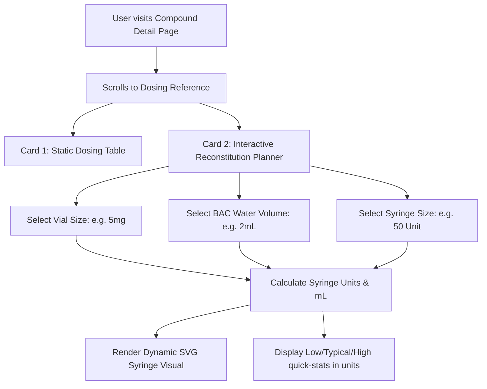

# Dosing Reference Redesign & Reconstitution Planner

This document outlines a plan to transform the static, technical **Dosing Reference** catalog card into an interactive, visually rich tool tailored for non-technical users. It addresses the math and safety friction points associated with peptide reconstitution and syringe measurement.

---

## 1. Core Objectives & Problem Statement

### The Problem
Currently, the Dosing Reference card displays doses in raw mass units (e.g., `250 mcg` or `5.0 mg`). For a non-technical user:
1. **The Math Barrier**: Peptides are shipped as dry lyophilized powder in vials. To administer a dose, they must dilute (reconstitute) it with Bacteriostatic (BAC) Water. Calculating the volume (mL) containing a specific microgram dose is error-prone.
2. **The Syringe Mapping Barrier**: Subcutaneous injections typically use standard U-100 insulin syringes marked in "units" (where $100\text{ units} = 1.0\text{ mL}$). Mapping milliliters to syringe units is a common source of dosing errors.

### The Goals
* **Demystify the Math**: Remove any manual calculation. Let the user see their dose in syringe units based on their specific vial and dilution.
* **Visualize the Measurement**: Show a dynamic, realistic representation of a syringe plunger lined up at the exact tick mark.
* **Promote Safety**: Highlight conversion tooltips (e.g., $1.0\text{ mg} = 1000\text{ mcg}$) and sterile preparation guidelines.

---

## 2. Proposed Features & UX Flow



### Feature A: The Interactive Reconstitution Calculator
An interactive form embedded directly within the Dosing Reference section:
* **Vial Size Selector**: Dropdown or slider (e.g., `2 mg`, `5 mg`, `10 mg`, `15 mg`, or custom input).
* **BAC Water Volume Selector**: Dropdown (e.g., `1.0 mL`, `2.0 mL`, `2.5 mL`, `3.0 mL`, or custom input).
* **Syringe Size Selector**: Dropdown containing standard syringe capacities:
  * `0.3 mL` (30 Units)
  * `0.5 mL` (50 Units)
  * `1.0 mL` (100 Units)
* **Real-time Outputs**: For each dose tier (Low, Typical, High), calculate:
  * **Volume to draw** in milliliters (mL).
  * **Syringe units** to draw (based on standard U-100 concentration, where $1\text{ unit} = 0.01\text{ mL}$).
  * **Syringe Capacity Warnings**: If a high dose exceeds the selected syringe's capacity, show a warning.

### Feature B: Visual SVG Syringe Simulator
A premium, animated SVG rendering of an insulin syringe that dynamically updates:
* **The Barrel**: Shows tick marks matching the selected syringe size (0.3 mL, 0.5 mL, or 1.0 mL).
* **The Plunger**: Moves smoothly to the exact target units calculated for the selected dose level (Low, Typical, or High).
* **Vibrant Styling**: Glow effects, glassmorphic styling, and clean animations to make it feel tactile and premium.

### Feature C: Presets & "Quick Reference" Grid
If a user does not want to fill out the form, we display a default "Standard Preparation" quick-reference table based on typical industry concentrations:
* **For Microgram-range Compounds** (e.g., BPC-157, Semorelin, Ipamorelin):
  * Preset: **5 mg vial reconstituted with 2.0 mL BAC water** ($25\text{ mcg per unit}$).
* **For Milligram-range Compounds** (e.g., Tirzepatide, Semaglutide):
  * Preset: **10 mg vial reconstituted with 2.0 mL BAC water** ($50\text{ mcg per unit}$).

---

## 3. The Mathematics Engine

The calculator will use the following formulas:

$$\text{Total Mass in Vial (mcg)} = \text{Vial Size (mg)} \times 1000$$

$$\text{Concentration } (C) = \frac{\text{Total Mass (mcg)}}{\text{BAC Water Volume (mL)}} \quad [\text{mcg/mL}]$$

$$\text{Volume to Draw (mL)} = \frac{\text{Target Dose (mcg)}}{\text{Concentration } (C)}$$

$$\text{Syringe Units (U-100)} = \text{Volume to Draw (mL)} \times 100$$

### Example Calculation: BPC-157 Typical Dose
* **Target Dose**: $500\text{ mcg}$
* **Vial Size**: $5\text{ mg} = 5000\text{ mcg}$
* **BAC Water**: $2.0\text{ mL}$
* **Concentration**: $\frac{5000}{2.0} = 2500\text{ mcg/mL}$
* **Volume to Draw**: $\frac{500}{2500} = 0.2\text{ mL}$
* **Syringe Units**: $0.2 \times 100 = 20\text{ units}$

---

## 4. Proposed UI Design (Tailwind CSS Integration)

The redesigned block will reside in `app/(dashboard)/reference/[slug]/page.tsx` and will replace the static table with a dual-pane layout:
* **Left Column**: Interactive Controls (Vial, Water, Syringe) and Dose Tier Cards.
* **Right Column**: The Visual Syringe Simulator & Reconstitution Guide.

### Mockup Structure
```
+---------------------------------------------------------------------------------+
| ⏱️ Dosing Reference & Reconstitution Planner                                      |
+---------------------------------------------------+-----------------------------+
| Interactive Config                                | Visual Syringe (U-100)      |
|                                                   |                             |
| 1. Vial Size        2. Dilution   3. Syringe Size |   |=================|       |
|    [ 5 mg    v]       [ 2.0 mL v]   [ 50 Unit v]  |   |    5  10  15  20| [ === ] |
|                                                   |   |____|___|___|___|| Plunger |
| Select Dose Tier to View:                         |   |                 | (Draw   |
| [ ] Low:     250 mcg (10 Units)                   |   |====############ |  Level) |
| [*] Typical: 500 mcg (20 Units)                   |   |=================|       |
| [ ] High:    1000 mcg (40 Units)                  |                             |
|                                                   | Draw exactly: 20 Units      |
| Volume concentration: 2.5 mg/mL (25 mcg/unit)     | (0.20 mL of liquid)         |
+---------------------------------------------------+-----------------------------+
| 💡 Reconstitution Prep Instructions                                             |
| 1. Sanitize vial stopper and BAC water bottle with alcohol pads.                |
| 2. Draw 2.0 mL of air into syringe, inject into BAC water to equalize pressure. |
| 3. Draw 2.0 mL of liquid BAC water and slowly transfer down the side of vial.   |
| 4. Do not shake. Gently swirl until powder is fully dissolved.                  |
+---------------------------------------------------------------------------------+
```

---

## 5. Technical Implementation Steps

1. **Client-Side State Management**:
   * Add a Client Component wrapper (e.g., `<DosingReconstitutionPlanner />`) inside `app/(dashboard)/reference/[slug]/page.tsx`.
   * Manage local state for:
     * `vialSizeMg` (default to a typical value based on compound type: `5` for mcg peptides, `10` for mg weight-loss/therapeutic peptides).
     * `dilutionMl` (default to `2.0` mL).
     * `syringeSizeUnits` (default to `100` units / 1.0 mL).
     * `selectedTier` (default to `'typical'`).
2. **SVG Syringe Component**:
   * Create a modular React SVG component `<SyringeGraphic units={selectedUnits} maxUnits={syringeSizeUnits} />`.
   * Animate the plunger using CSS transitions (`transition-all duration-300`) on the SVG `<rect>` or `<path>` attributes to ensure smooth movement when toggling between Low, Typical, and High doses.
3. **Safety Disclaimer & Edge Cases**:
   * **Capacity Overflow**: If the calculated units exceed `syringeSizeUnits`, display a red warning text: *"Warning: This dose exceeds the syringe capacity. Prepare a higher concentration or administer in multiple draws."*
   * **Validation Guard**: Ensure that no division-by-zero occurs if inputs are cleared or invalid.
4. **TDD Coverage**:
   * Colocate client unit tests in `app/(dashboard)/reference/_components/DosingReconstitutionPlanner.test.tsx` verifying:
     * Correct calculations for typical vial/water combinations.
     * Capacity warnings triggering correctly.
     * Plunger position calculations.

---

## 6. Schema/Database Implications

No database schema migrations are necessary! All math is derived entirely on the client-side based on the existing `dosingLow`, `dosingTypical`, and `dosingHigh` fields from the `CompoundProfile` table. This keeps the implementation light, secure, and isolated to the presentation layer.
