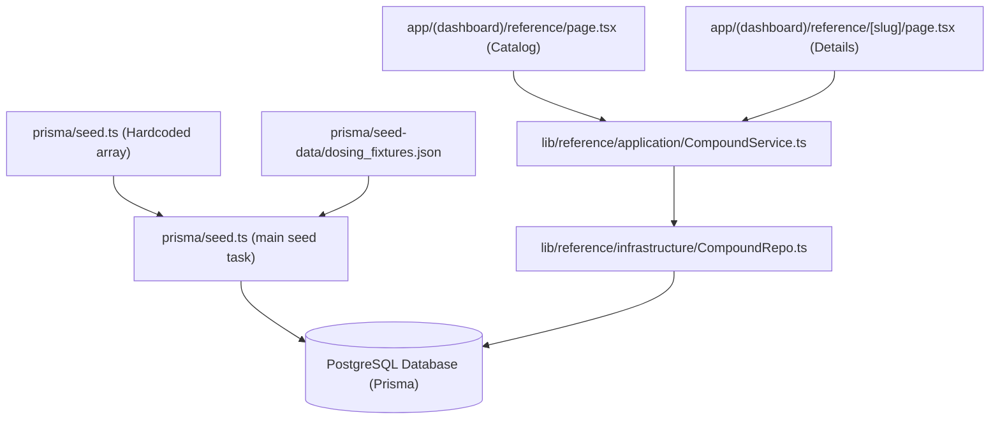

# Compound Catalog Architecture: Dev Environment

This document outlines how the compound catalog is generated, seeded, stored, and queried in the Peptides application today.

---

## 1. Data Flow Architecture

The data flow spans from static seed definitions to application runtime queries:

---

## 2. Seed Data Sources (Where Compound Info Comes From)

In the development environment, compound information is established via the Prisma database seeding script:

1. **`prisma/seed.ts`**:
   - Contains a large, structured `compounds` array (around lines 22–1649) detailing each compound's properties, including:
     - `name`, `iupacName`, and `synonyms` (such as `Pentadecapeptide BPC-157`).
     - `mechanismOfAction`: Detailed markdown split into technical science, layman analogy, and expected timelines.
     - `tags` (e.g., `["healing", "recovery"]`) and `administrationRoutes` (`["SubQ", "IM", "Oral"]`).
     - Dosing tiers (low, typical, high), citations, shelf-lives, and stability days.
2. **`prisma/seed-data/dosing_fixtures.json`**:
   - A static JSON file containing supplementary profile data and citations for compounds. During seeding, the database upserts compile data by matching entries in this file against the primary seed array.
3. **Timeline Generation (`getBenefitTimelineForSeed`)**:
   - The compound's **Expected Benefit Timeline** (Week 1, Week 2, Week 4, etc.) is generated dynamically during database seeding via a helper function inside `seed.ts` (lines 1928–2080). It parses the compound's name and tags to map standard milestones and clinical expectations.

---

## 3. Database Schema

Stored in `prisma/schema.prisma` under the Reference Domain:

* **`Compound`**: Stores basic identity, name, slug, synonyms (stored as lowercase arrays for case-insensitive lookup), mechanism of action, and tags.
* **`CompoundProfile`**: Holds JSON structures for dosing (`dosingLow`, `dosingTypical`, `dosingHigh`), timeline (`benefitTimeline`), and stability configurations (`reconstitutedShelfLifeDays`, `fridgeShelfLifeMonths`, `freezerShelfLifeMonths`).
* **`Citation`**: Curated references mapping back to the profile with PubMed PMIDs, DOIs, and Titles.

---

## 4. Query & Retrieval Pipeline

When pages load, they fetch catalog data via a clean, layered service-to-repository architecture:

1. **Page Routes**:
   - **Catalog Index**: [reference/page.tsx](file:///Users/kenallred/Developer/peptides/app/(dashboard)/reference/page.tsx) uses Next.js server actions / async page components to render list results based on search parameters (`q` for text queries, `tag` for category filters).
   - **Catalog Details**: [reference/[slug]/page.tsx](file:///Users/kenallred/Developer/peptides/app/(dashboard)/reference/[slug]/page.tsx) queries details for the selected compound by matching the route slug parameter.
2. **Service Layer**:
   - [CompoundService.ts](file:///Users/kenallred/Developer/peptides/lib/reference/application/CompoundService.ts) acts as the application boundary, exporting `listCompounds`, `searchCompounds`, and `getCompoundBySlug`.
3. **Repository Layer**:
   - [CompoundRepo.ts](file:///Users/kenallred/Developer/peptides/lib/reference/infrastructure/CompoundRepo.ts) implements the database access. It connects to the Postgres instance using Prisma client and executes queries like `findMany` or `findFirst`, requesting relations (`profile` and `citations`) in a single query.
   - It also handles data conversion: raw JSON fields from the database are parsed and type-checked via domain validators defined in [validation.ts](file:///Users/kenallred/Developer/peptides/lib/reference/domain/validation.ts).
