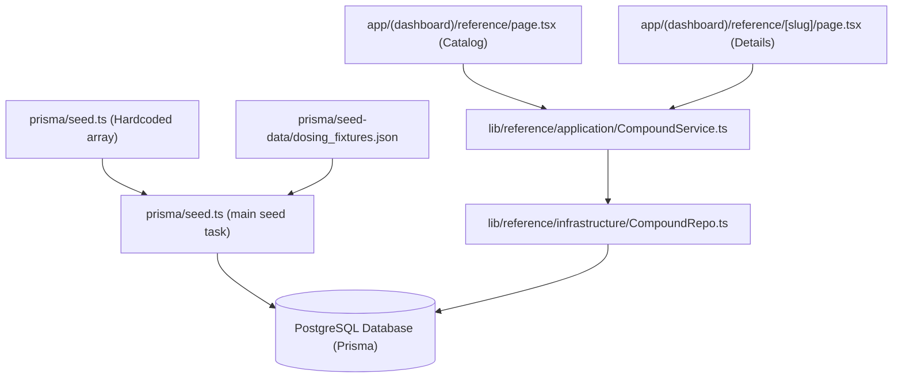

# Compound Catalog Architecture: Dev Environment

This document outlines how the compound catalog is generated, seeded, stored, and queried in the Peptides application today.

---

## 1. Data Flow Architecture

The data flow spans from static seed definitions to application runtime queries:

---

## 2. Seed Data Sources (Where Catalog Info Comes From)

In the development environment, catalog information is established via the Prisma database seeding script:

1. **`prisma/seed.ts`**:
   - Contains a large, structured `compounds` array detailing each item's properties. Top-level fields on `CatalogItem` include:
     - `name`, `iupacName`, and `synonyms` (such as `Pentadecapeptide BPC-157`).
     - `kind`: Discriminator (`PEPTIDE` or `SUPPLEMENT`).
     - `catalogKey`: Stable, code-assigned sync key for differential updates.
     - `mechanismOfAction`: A single markdown string split by `###` headers into technical science (`### The Technical Mechanism`), layman analogy (`### The Analogy`), and clinical timeline (`### Clinical Expected Timeline`). It is **not** separate object fields.
     - `tags` (e.g., `["healing", "recovery"]`) and `administrationRoutes` (`["SubQ", "IM", "Oral"]`).
   - Dosing tiers (`dosingLow`, `dosingTypical`, `dosingHigh`), `benefitTimeline`, shelf-lives, and stability days are **nested under a profile object** (`CompoundProfile` for peptides, `SupplementProfile` for supplements).
   - `citations` are now associated directly with the `CatalogItem` (repivoted from the profile in Phase 1).
   - During insertion, `synonyms` are lowercased so case-insensitive synonym search works (the repository relies on this — see §4).
2. **`prisma/seed-data/dosing_fixtures.json`**:
   - A static JSON file containing supplementary `profile` data and `citations` for items, keyed by `name`. During seeding, each seed item is matched to a fixture by name (**case-insensitive**). When a fixture is found:
     - The fixture's `profile` is **spread over** the seed profile (`{ ...seedProfile, ...fixture.profile }`), so fixture values override seed values.
     - If the fixture has non-empty `citations`, they **fully replace** the seed citations (not merged).
   - Fixtures supply richer protocol fields not present in the base seed array, e.g. `dosingFrequency`, `cycleLengthWeeks`, `restPeriodWeeks`, `daysOn`/`daysOff`, `preferredTime`, `timingNotes`, and `isFdaApproved`.
3. **Timeline Generation (`getBenefitTimelineForSeed`)**:
   - The item's **Expected Benefit Timeline** (Week 1, Week 2, Week 4, Week 8, Week 12) is generated dynamically during database seeding via a helper function inside `seed.ts`. It parses the item's name (with tag-based fallbacks for `healing`/`recovery`, `weight-loss`/`metabolic`, `longevity`/`skin`/`anti-aging`, `cognitive`/`brain`) to map standard milestones and clinical expectations into an array of `{ week, benefits }` entries.

---

## 3. Database Schema

Stored in `prisma/schema.prisma` under the Reference Domain:

* **`CatalogItem`**: Identity and catalog metadata — `name` (unique), `slug` (unique), `catalogKey` (unique sync key), `kind` (`PEPTIDE` | `SUPPLEMENT`), `iupacName`, `synonyms` (`String[]`, stored lowercase at seed time for case-insensitive lookup), `mechanismOfAction`, `administrationRoutes` (`String[]`), `tags` (`String[]`), `status` (default `PUBLISHED`), and `archivedAt`. Relations: `profile` (1:1 with `CompoundProfile`), `supplementProfile` (1:1 with `SupplementProfile`), `citations` (1:N), `revisions` (1:N), plus `products`, `protocols`, `vials`, and `orderItems` referenced by other domains.
* **`CompoundProfile`**: Holds the dosing/protocol/stability data for a peptide. JSON dosing fields `dosingLow`, `dosingTypical`, `dosingHigh`; JSON `benefitTimeline`; stability `reconstitutedShelfLifeDays`, `fridgeShelfLifeMonths` (default 12), `freezerShelfLifeMonths` (default 24). It also stores scalar protocol/scheduling fields: `sideEffects`, `stackingNotes`, `cycleLengthWeeks`, `restPeriodWeeks`, `dosingFrequency` (enum), `dosesPerDay`, `customFrequencyDescription`, `daysOn`, `daysOff`, `preferredTime` (enum), `timingNotes`, and `isFdaApproved` (default `false`).
* **`SupplementProfile`**: Holds the dosing and serving data for a supplement. JSON dosing fields `dosingLow`, `dosingTypical`, `dosingHigh`; JSON `benefitTimeline`; scalar serving fields: `form` (e.g. CAPSULE), `servingSize` (`Decimal`), `servingUnit`.
* **`Citation`**: Curated references mapping back to the `CatalogItem` (`catalogItemId`) with `title`, `url`, `doi`, and PubMed `pmid`.

---

## 4. Query & Retrieval Pipeline

When pages load, they fetch catalog data via a clean, layered service-to-repository architecture:

1. **Page Routes**:
   - **Catalog Index**: [reference/page.tsx](file:///Users/kenallred/Developer/peptides/app/(dashboard)/reference/page.tsx) uses Next.js server actions / async page components to render list results based on search parameters (`q` for text queries, `tag` for category filters).
   - **Catalog Details**: [reference/[slug]/page.tsx](file:///Users/kenallred/Developer/peptides/app/(dashboard)/reference/[slug]/page.tsx) queries details for the selected item by matching the route slug parameter.
2. **Service Layer**:
   - [CompoundService.ts](file:///Users/kenallred/Developer/peptides/lib/reference/application/CompoundService.ts) acts as the application boundary, exporting `listCompounds`, `searchCompounds`, and `getCompoundBySlug`.
3. **Repository Layer**:
   - [CompoundRepo.ts](file:///Users/kenallred/Developer/peptides/lib/reference/infrastructure/CompoundRepo.ts) implements the database access. It connects to the Postgres instance using Prisma client and executes queries like `findMany` or `findFirst`, requesting relations (`profile`, `supplementProfile`, and `citations`) in a single query.
   - It also handles data conversion: raw JSON fields from the database are parsed and type-checked via domain validators defined in [validation.ts](file:///Users/kenallred/Developer/peptides/lib/reference/domain/validation.ts) — chiefly `parseCompoundDosing` (Zod `DoseAmountSchema`) and `parseBenefitTimeline` (Zod `BenefitTimelineSchema`). The module also exports `DosingFrequencySchema`, `PreferredTimeSchema`, and `validateDosingProtocol`.

---

## 5. Display Layer (What the User Actually Sees)

Once the service/repository layer returns a validated item, the route pages render it through a set of client components. The **catalog index** (`reference/page.tsx`) renders a searchable/filterable card list via `CatalogSearch.tsx` (driving the `q` and `tag` URL params). The **detail page** (`reference/[slug]/page.tsx`) is substantially richer than the raw data model and is composed of several interactive components:

* **Interactive Reconstitution / Dosing Planner** (`DosingReconstitutionPlanner`): An animated SVG syringe visualization with real-time plunger position, vial-size and BAC-water presets (plus custom inputs), syringe-size selection (30/50/100 U), low/typical/high dose tabs, live mg/mL and mcg/Unit concentration math, syringe-overflow detection, a step-by-step reconstitution checklist, and a conditional FDA-approval badge.
* **Catalog Item Inventory Manager** (`CompoundInventoryManager`): Tracks dry and reconstituted vials with expiration badges (`EXPIRED`, `EXPIRING_SOON`, `LOW_INVENTORY`), an inline reconstitution workflow, auto-calculated expiration from storage method and shelf-life metadata, concentration calculation, and per-vial remaining-quantity editing.
* **Clinical Progression Timeline**: Renders `benefitTimeline` as a week-by-week visualization with phase labels (Acute Onset, Stabilization, Therapeutic Phase, Remodeling, Peak Efficacy), animated nodes, and per-week benefit bullets.
* **Protocol & Scheduling Panel**: Surfaces the profile scheduling fields — cycle duration, rest/washout period, frequency patterns (days on/off, doses per day, custom descriptions), and preferred administration time — with explanatory `InfoTooltip` hover content.
* **Safety & Reference Content**: FDA-approval/disclaimer banners for non-approved items, `sideEffects` and `stackingNotes` sections, administration routes, mechanism-of-action markdown, IUPAC name/synonyms, and citation rendering with resolved PubMed/DOI links.

### 5.1 Cross-Domain Composition

The reference detail page is a composition surface, not a pure view of the reference catalog. Most of the page (mechanism, dosing tiers, timeline, protocol, citations) is rendered from the **admin-curated, global** `CatalogItem` data described above. The **Inventory Manager**, however, renders **user-scoped vial data owned by the reconstitution domain** — it is keyed by `userId` and is not part of the reference catalog. The page simply mounts that component alongside the catalog content for the matching item.

This distinction matters for two reasons:

* **Identity scoping**: Reference reads are exempt from `userId` scoping (admin-curated global data — see `CLAUDE.md`), but the inventory/vial reads composed onto the same page are **not** exempt and must remain `userId`-scoped.
* **Precision/safety boundary**: The interactive math (concentration, dose volume, expiration) is computed client-side from the validated item profile and the user's inventory, but the canonical `Decimal`-based safety/precision rules for that math live in the reconstitution and safety-math domains, not in the reference layer.
