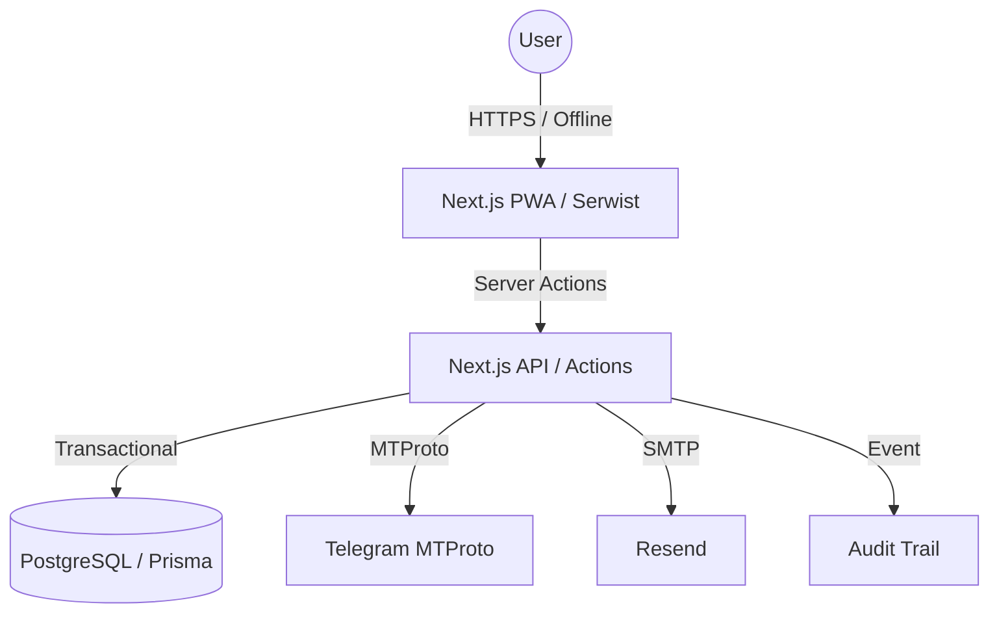

# Developer Onboarding Guide

Welcome to the **Peptides** project. This guide will help you understand the system architecture, setup your local environment, and start contributing.

---

## 1. Project Purpose
Peptides is a secure, offline-first PWA for tracking personal peptide protocols and automating vendor communication via Telegram MTProto. It replaces complex spreadsheets with a safety-conscious, multi-user web application.

---

## 2. Quick Start (15 minutes)

### Prerequisites
- **Node.js**: 22.x
- **pnpm**: 9.x
- **Docker**: For PostgreSQL 16

### Setup
```bash
# 1. Clone & Install
git clone <repo-url> && cd peptides
pnpm install

# 2. Configure Environment
cp .env.example .env

# 3. Start Infrastructure
make db-setup

# 4. Start Development
make dev
```
**Verify**: Open [http://localhost:3000](http://localhost:3000). You should see the landing page.

---

## 3. Architecture Overview

Peptides is a **Modular Monolith** built on Next.js 15. It is organized into bounded contexts to ensure isolation and maintainability.

### 3.1 Component Diagram


### 3.2 Key Decisions (ADR Summary)
- **ADR-001 (Monolith)**: Single codebase for UI and API to minimize solo-dev overhead.
- **ADR-005 (MTProto)**: Direct user-level Telegram access via GramJS (Bot API was insufficient).
- **ADR-007 (PWA)**: Offline-first dose logging via Serwist to support "gym mode" usage.
- **ADR-015 (Isolation)**: The Ordering module is architecturally isolated and can be disabled via env var.

---

## 4. Key Coding Patterns

### 4.1 Transactional Audit
Every sensitive mutation (Protocols, Orders) must be wrapped in a Prisma transaction that includes an `AuditEvent` write. Use the `withAudit` helper.

### 4.2 Decimal Precision
**Rule**: Never use `Float` for doses or volumes. Always use `Decimal` from Prisma or `decimal.js` to prevent rounding errors in safety-critical math.

### 4.3 Identity Scoping (IDOR)
Every database query MUST include the user's ID:
`db.protocol.findFirst({ where: { id, userId: session.user.id } })`

---

## 5. Development Workflow

We use a strict **One Task = One Branch** workflow.

1. **Branch**: `feat/task-name` or `fix/task-name`.
2. **TDD**: Write the acceptance test in `tests/acceptance/` first.
3. **Build**: Prove your work with `make check` (Lint + Type + Test).
4. **Review**: Run `scaffold run review-code` for a multi-model MMR audit.
5. **Merge**: `gh pr create --fill` -> Squash merge to `main`.

---

## 6. Where to Find Things

```
/
├── app/            # UI Layer (Routes & Pages)
├── lib/            # Core Logic (Bounded Contexts)
│   ├── auth/       # Identity & Permissions
│   ├── tracker/    # Dosing & Protocols
│   ├── ordering/   # Telegram & Sourcing
│   └── audit/      # Immutable Logs
├── prisma/         # Database Schema
├── tests/          # Acceptance & E2E Suites
└── docs/           # Specifications & ADRs
```

---

## 7. Troubleshooting

- **MTProto Session Dead**: Ensure `TELEGRAM_APP_ID` is valid in `.env`.
- **Sync Failures**: Clear IndexedDB in browser DevTools and retry.
- **Math Errors**: Run `pnpm test` on `lib/reconstitution` to verify `Decimal` logic.

---

## 8. Guide vs Playbook
- **Onboarding Guide (This Doc)**: Mental model, setup, and architecture. Read once.
- **Implementation Playbook**: Step-by-step instructions for specific tasks. Reference during coding.
