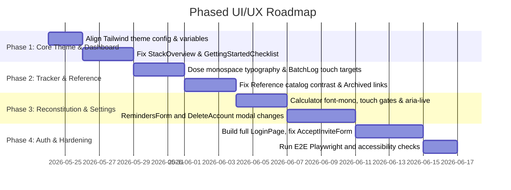

# UI/UX Audit Report & Phased Roadmap

This document outlines the findings of our comprehensive codebase audit against the [Design System](design-system.md), [UX Specification](ux-spec.md), and modern web UI/UX best practices.

---

## 1. Audit Findings by Route

### 1.1 Auth & Onboarding Routes
*   **LoginPage ([app/(auth)/login/page.tsx](../app/(auth)/login/page.tsx))**:
    *   *Issue*: Minimal stub rendering a bare `<h1>Login</h1>`. Entirely lacks form controls, branding, and standard layout.
*   **AcceptInviteForm ([app/(auth)/accept-invite/_components/AcceptInviteForm.tsx](../app/(auth)/accept-invite/_components/AcceptInviteForm.tsx))**:
    *   *Design System Drift*: Hardcoded `bg-indigo-600`, `hover:bg-indigo-700`, and `focus:ring-indigo-500` instead of using the custom `primary` theme tokens (`hsl(var(--primary))`).
    *   *Accessibility*: The checkbox has no custom styling, border, or outline, and its tap target is under 44px. Focus transitions default to native browser rendering.
*   **OnboardingWizard ([app/(onboarding)/onboarding/_components/OnboardingWizard.tsx](../app/(onboarding)/onboarding/_components/OnboardingWizard.tsx))**:
    *   *Design System Drift*: Hardcoded `bg-indigo-600`, `text-indigo-600`, and `ring-indigo-600` styling.
    *   *Accessibility*: Continue button uses `py-2.5` which produces a height of ~38px, falling short of the 44px mobile touch target rule. Lack of an `aria-live` announcement region when switching wizard steps.

### 1.2 Dashboard Route
*   **GettingStartedChecklist ([app/(dashboard)/dashboard/_components/GettingStartedChecklist.tsx](../app/(dashboard)/dashboard/_components/GettingStartedChecklist.tsx))**:
    *   *Design System Drift*: Hardcoded `bg-indigo-600`, `text-indigo-600`, and progress-bar background.
    *   *Accessibility*: "Continue Setup" button has a sub-44px touch height (`py-2` style).
*   **StackOverview ([app/(dashboard)/dashboard/_components/StackOverview.tsx](../app/(dashboard)/dashboard/_components/StackOverview.tsx))**:
    *   *Design System Drift*: Action links are styled with `bg-indigo-50 border-indigo-200 text-indigo-700 hover:bg-indigo-100` instead of using semantic `card` or `primary` variables.
    *   *Accessibility*: Navigation buttons inside the empty state (Browse Catalog, Create Protocol) are under the 44px touch target threshold (`py-2`).

### 1.3 Tracker & Outcomes Routes
*   **TrackerPage ([app/(dashboard)/tracker/page.tsx](../app/(dashboard)/tracker/page.tsx))**:
    *   *Typography Violation*: Dose details (e.g., `p.dose.amount p.dose.unit`) do not use monospaced fonts (`font-mono` / JetBrains Mono) as required for math and numbers.
    *   *Design System Drift*: Cycle overview banner hardcodes indigo gradients (`bg-indigo-50 border-indigo-200 text-indigo-800`).
*   **BatchLogReview ([app/(dashboard)/tracker/_components/BatchLogReview.tsx](../app/(dashboard)/tracker/_components/BatchLogReview.tsx))**:
    *   *Accessibility*: Checkbox inputs have a small touch footprint, and the primary "Confirm" button has a sub-44px target (`py-2`). No `aria-live` region announces successful logs, skips, or validation warnings when logging.
    *   *Typography*: Doses (e.g. `item.protocol.dose.amount`) are rendered in proportional sans-serif.

### 1.4 Reconstitution Calculator
*   **ReconstitutionCalculatorForm ([app/(dashboard)/reconstitution/_components/ReconstitutionCalculatorForm.tsx](../app/(dashboard)/reconstitution/_components/ReconstitutionCalculatorForm.tsx))**:
    *   *Typography Violation*: Main calculation displays (units per dose, concentration mg/mL, and injection volume) do not use monospaced styling.
    *   *Design System Drift*: Banners and buttons hardcode indigo styles (`bg-indigo-50 border-indigo-200 text-indigo-700`).
    *   *Accessibility*: Sizing for inputs and CTA buttons falls short of the 44px touch target size. Missing `aria-live="polite"` region on the calculations container; changes to concentrations or warning alerts are not announced to screen readers.

### 1.5 Compound Reference Catalog
*   **ReferencePage & CatalogSearch ([app/(dashboard)/reference/page.tsx](../app/(dashboard)/reference/page.tsx))**:
    *   *WCAG Contrast Failure*: The "Profile in progress" tag text (`text-xs text-gray-400 bg-gray-100`) has a contrast ratio of only **1.86:1** (fails WCAG AA threshold of 4.5:1).
    *   *UX Mismatch*: Archived cards (`compound.status === 'ARCHIVED'`) still render as a full clickable `Link` wrapper, violating UX spec 3.4 (archived elements should have "no profile link" and show as a greyed card).
    *   *Skeleton Loading*: Uses a raw `Loading...` text fallback instead of animated dashboard skeleton loaders.
*   **CompoundProfilePage ([app/(dashboard)/reference/[slug]/page.tsx](../app/(dashboard)/reference/[slug]/page.tsx))**:
    *   *WCAG Contrast Failure*: The IUPAC Name rendering (`text-xs text-gray-400 font-mono`) has a contrast ratio of **1.96:1** (fails WCAG AA).
    *   *Design System Drift*: Hardcoded indigo links and badges.

### 1.6 Settings & Admin Routes
*   **DeleteAccountSection ([app/(dashboard)/settings/_components/DeleteAccountSection.tsx](../app/(dashboard)/settings/_components/DeleteAccountSection.tsx))**:
    *   *UX Mismatch*: Implemented as inline toggleable blocks instead of a multi-step modal structure. The confirmation prompt asks for email address rather than typing "DELETE" as dictated by UX spec 2.7.
    *   *Accessibility*: Destructive actions hide browser outlines (`focus:outline-none`) but fail to supply custom high-contrast focus rings (`ring-2 ring-red-500`). Sizing of action buttons is sub-44px (`py-2`).
*   **RemindersForm ([app/(dashboard)/settings/_components/RemindersForm.tsx](../app/(dashboard)/settings/_components/RemindersForm.tsx))**:
    *   *Design System Drift*: Hardcoded indigo focus borders and background colors.

---

## 2. Phased Implementation Roadmap

To align the user interface with our rules while ensuring functional and test integrity, we propose a 4-phase rollout:

### Phase 1: Global Theme & Core Dashboard
*   **Goals**: Standardize theme tokens and fix visual layout drift on the primary landing path.
*   **Tasks**:
    1.  Confirm HSL variables for background, card, border, primary, success, warning, destructive, and text in the main layout configuration.
    2.  Update [StackOverview.tsx](../app/(dashboard)/dashboard/_components/StackOverview.tsx) and [GettingStartedChecklist.tsx](../app/(dashboard)/dashboard/_components/GettingStartedChecklist.tsx) to consume colors from `primary` theme tokens rather than hardcoding indigo classes.
    3.  Increase button vertical paddings on empty states to meet the 44px tap target size.
    4.  Define layout routing and redirection between the desktop side drawer navigation and the mobile bottom navigation bar (under 640px) to prevent layout inconsistency per [UX Specification](ux-spec.md) Section 5.
    5.  Validate dark mode variants (`dark:bg-card`, `dark:border-border`, etc.) using custom HSL tokens to ensure compliance with the dark token values defined in the [Design System](design-system.md).

### Phase 2: Tracker & Reference Catalog
*   **Goals**: Correct typography rules for math display, resolve severe WCAG contrast failures, and fix archived linking logic.
*   **Tasks**:
    1.  Convert dose and concentration figures in [TrackerPage](../app/(dashboard)/tracker/page.tsx) and [BatchLogReview.tsx](../app/(dashboard)/tracker/_components/BatchLogReview.tsx) to monospaced text (`font-mono` / JetBrains Mono).
    2.  Update [ReferencePage](../app/(dashboard)/reference/page.tsx) to render greyed-out, unclickable card elements for `ARCHIVED` status.
    3.  Raise contrast for "Profile in progress" and IUPAC font indicators to satisfy the 4.5:1 WCAG AA ratio.
    4.  Add custom Tailwind skeleton animations in place of fallback text strings.

### Phase 3: Reconstitution & Settings
*   **Goals**: Add accessibility cues (`aria-live`) for dynamic calculations and align account deletion with the UX specifications.
*   **Tasks**:
    1.  Inject `aria-live="polite"` inside [ReconstitutionCalculatorForm.tsx](../app/(dashboard)/reconstitution/_components/ReconstitutionCalculatorForm.tsx) to dynamically announce drawn syringe unit results.
    2.  Add monospace fonts for calculated volume/syringe parameters.
    3.  Re-engineer the [DeleteAccountSection](../app/(dashboard)/settings/_components/DeleteAccountSection.tsx) to present the multi-step modal flow, including the radio selector (Delay 48h vs Immediate) and the 5-character confirmation input typing "DELETE".
    4.  Ensure focus rings remain visible for all form elements in settings and profile forms.
    5.  Add automated unit/integration test coverage specifically asserting the `WarningPolicy` threshold trigger behaviors (volume > 1.5mL and BAC < 0.5mL warnings) in the UI code.

### Phase 4: Auth & Hardening
*   **Goals**: Build out the missing login components and run end-to-end verification.
*   **Tasks**:
    1.  Replace the temporary stub in [LoginPage](../app/(auth)/login/page.tsx) with a production-ready, beautifully styled authentication interface (matching our clinical-but-modern guidelines).
    2.  Standardize email acceptance checkboxes and focus rings inside [AcceptInviteForm.tsx](../app/(auth)/accept-invite/_components/AcceptInviteForm.tsx).
    3.  Verify full build compilations and ensure existing E2E/Vitest tests pass without regressions.
