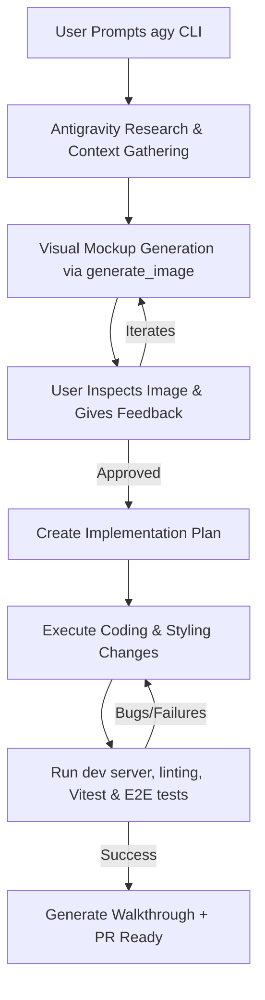

# Web Application UI/UX Upgrade & Iteration Strategy

This document provides a comprehensive research report on modern UI/UX best practices, details how to leverage **Antigravity (via the agy CLI)** to execute UI/UX upgrades, and outlines a step-by-step iterative workflow tailored to the **Peptides** codebase constraints.

---

## 1. Research: Modern Web UI/UX Best Practices

To design interfaces that feel premium, trustworthy, and highly functional (especially for clinical or health-adjacent apps like Peptides), we must focus on four main pillars: visual aesthetics, state communication, accessibility, and offline-first performance.

### 1.1 Visual Hierarchy & Premium Aesthetics
*   **Harmonious Color Systems**: Move away from browser-default or raw primary colors (e.g., `#0000FF` blue or `#FF0000` red). Instead, use curated palettes based on custom Tailwind variables or OKLCH/HSL color scales. Define semantic mappings:
    *   *Primary*: Trustworthy clinical blue or violet (e.g., Blue 500/600 or Indigo 500/600).
    *   *Success*: Clean, non-neon emerald/green (e.g., `#10b981`) representing logged doses and verified data.
    *   *Warning/Error*: Soft, high-contrast ambers and reds (e.g., `#f59e0b` and `#ef4444`) to highlight calculation alerts or payment mismatches without causing user panic.
*   **Typography Scale & Monospace Utility**: Use a highly readable sans-serif (such as `Inter` or `Outfit`) for text and navigation. Use a high-quality monospaced font (like `JetBrains Mono`) for all numeric math, dose weights, syringe units, wallet addresses, and timestamps to maintain layout alignment and readability.
*   **Glassmorphism & Spatial Depth**: Use subtle translucent backgrounds (`backdrop-blur-md bg-white/75` or `bg-slate-900/80`), light borders, and multi-layered soft shadows (`shadow-sm`, `shadow-md`) to separate content containers and make elements float.

### 1.2 Interactive State Machines & Transitions
*   **Form State Integrity**: Forms should communicate their status through a strict state machine:
    $$\text{IDLE} \rightarrow \text{DIRTY} \rightarrow \text{VALIDATING} \rightarrow \text{SUBMITTING} \rightarrow \text{SUCCESS / ERROR}$$
    During submission, primary CTA buttons must disable and show a loading spinner (or progress state) to prevent double-submits.
*   **Micro-interactions**: Incorporate subtle, fast micro-animations (e.g., 200ms ease-out transitions) on buttons, checkbox checks, and input focus. Use skeleton loader components for dynamic catalogs or tables during load times to reduce perceived latency.

### 1.3 Strict Accessibility (WCAG 2.1 AA)
*   **Touch Targets**: Mobile tap areas must be at least 44x44px. This is critical for users logging daily doses or tracking protocols on mobile devices.
*   **Keyboard Navigation & Focus Management**:
    *   Dialogs and side drawers (e.g., calculation sheets, profile sheets) must implement focus trapping.
    *   Users must be able to escape sheets/modals with the `Escape` key, and all inputs must have a visible primary-colored focus outline (`ring-2 ring-primary`).
*   **Aria-Live Announcements**: Status updates, alerts (like exceeding reconstitution dose thresholds), and synchronization indicators must be announced via `aria-live="polite"` (or `aria-live="assertive"` for critical safety warnings).

### 1.4 PWA & Offline Support
*   **Connectivity Banners**: When offline, a clear, persistent warning (e.g., high-contrast amber banner) should inform the user that changes are being queued in local storage (like IndexedDB) and will sync once connection is restored.
*   **Optimistic UI**: Instantly transition logged states on the UI, updating history items immediately while the PWA background worker queue syncs to the server.

---

## 2. Iterating on UI/UX with Antigravity (agy CLI)

Upgrading UI/UX using an AI agent requires a tightly coupled visual and functional feedback loop. Because Antigravity is equipped with both file-system writing capabilities and an **image generator**, you can iterate on both the aesthetic mocks and actual code step-by-step.

### 2.1 Tool Mapping for UI/UX Tasks
*   `generate_image`: Creates high-fidelity mockup illustrations of pages, dashboards, and custom widgets directly in the workspace so you can align on layout, color, and spacing before writing CSS/TSX.
*   `view_file` & `replace_file_content`: Read and surgically edit components without replacing large portions of files (which degrades efficiency and runs risk of syntax breaking).
*   `run_command`: Launches the local dev server (`pnpm dev` or `make dev`), formats code (`pnpm format`), typechecks (`pnpm typecheck`), and runs test suites (`pnpm test` and `pnpm e2e`).

---

## 3. Recommended Plan and Approach (No-Gaps Workflow)

Here is the step-by-step process you should use to prompt Antigravity to upgrade a specific UI flow (e.g., the Reconstitution Calculator or Dashboard Stack Overview):

### Phase 1: Visual Design Alignment (Discovery & Mockups)
1.  **Prompt**: Describe the page/component you want to upgrade and ask Antigravity to search the workspace files and generate a mockup.
    *   *Example*: `"Research our existing ReconstitutionCalculatorForm.tsx and docs/ux-spec.md. Generate a visual mockup showing a premium, high-fidelity redesign of this calculator."`
2.  **Action by Antigravity**:
    *   Locates the form file and relevant documentation.
    *   Calls `generate_image` to create a mockup saved in the workspace.
    *   Returns the path to the mockup image.
3.  **Aesthetic Iteration**: Inspect the generated image, critique the colors, typography, or spacing, and request refinements until you are fully satisfied.

### Phase 2: Technical Design & Rule Compliance
1.  **Draft Plan**: Once the visual is agreed, Antigravity enters planning mode and drafts an `implementation_plan.md`.
2.  **Verify Rules & Guidelines**: The plan must strictly respect the codebase rules defined in `AGENTS.md` and `CLAUDE.md`:
    *   *Dose Math Safety*: Confirm that any calculations use `Decimal` (from `decimal.js`), not JavaScript `Float` numbers.
    *   *Authentication Security*: Verify that any dashboard or data reads scope queries by `userId` (e.g. `where: { userId: session.user.id }`).
    *   *Audit Logging*: Ensure any user mutations (saving a vial, logging a dose) call the audit logger via transactions.
    *   *TDD Compliance*: Determine which unit tests (`tests/acceptance/`) or E2E tests need updating or writing.
3.  **Approval**: Review and approve the plan.

### Phase 3: Surgical Coding
1.  **Checkout & Checklist**: Antigravity creates `task.md` to track implementation checkboxes.
2.  **Incremental Styling**: Antigravity edits the TSX components using Tailwind CSS classes, matching the agreed mockup design system tokens.
3.  **Local Dev Verification**: Antigravity runs formatting (`pnpm format`) and starts the Next.js server to verify visual compiles.

### Phase 4: Automated & Manual Testing
1.  **Type & Lint Check**: Antigravity runs `pnpm typecheck` and `pnpm lint` to catch errors.
2.  **Unit & E2E Testing**: Run Vitest tests (`pnpm test`) to verify that calculations and state transitions remain intact. Run Playwright E2E tests (`pnpm e2e`) to verify page workflows.
3.  **Walkthrough Report**: Antigravity updates `walkthrough.md` highlighting:
    *   Files modified.
    *   How accessibility targets (WCAG contrast, touch targets) were checked.
    *   Testing commands executed and their output.

### Phase 5: Review & Merge
1.  **Review PR**: Run `scaffold run review-pr` or local review hooks.
2.  **Merge**: Create and merge the pull request.

---

## 4. Why This Approach Prevents Gaps

1.  **Visual Proof Before Code**: Generating images prevents "design mismatch" gaps. You see exactly what the layout looks like before any lines of CSS are written.
2.  **Strict Rule Preservation**: The implementation plan ensures project security constraints (such as `userId` scoping and `Decimal` math) are never forgotten or broken when changing styles.
3.  **Automated Quality Gates**: Running Vitest and Playwright after UI modifications guarantees that styling overrides do not accidentally break interactive features (e.g., disabling the submit button, failing form validation, or breaking database schemas).
